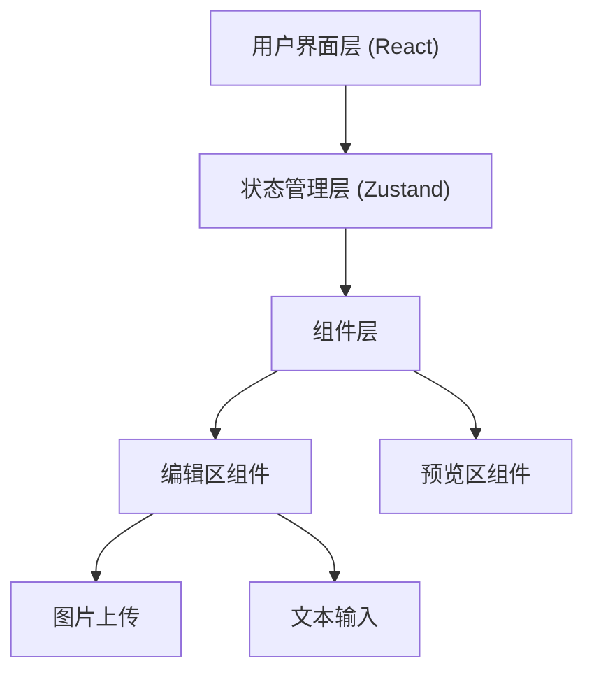

## 1. Architecture Design


## 2. Technology Description
- **前端**: React@18 + TypeScript + Tailwind CSS@3 + Vite
- **初始化工具**: vite-init
- **状态管理**: Zustand (轻量级状态管理)
- **图标库**: Lucide React
- **后端**: 无 (纯前端应用)

## 3. Route Definitions
| Route | Purpose |
|-------|---------|
| / | 主页，包含编辑区和预览区 |

## 4. Data Model

### 4.1 状态管理定义
```typescript
interface ReviewState {
  images: string[];
  movieTitle: string;
  content: string;
  addImage: (image: string) => void;
  removeImage: (index: number) => void;
  setMovieTitle: (title: string) => void;
  setContent: (content: string) => void;
}
```

## 5. File Structure
```
src/
├── components/
│   ├── EditorSection.tsx    # 编辑区组件
│   ├── PreviewSection.tsx   # 预览区组件
│   └── ImageUploader.tsx    # 图片上传组件
├── hooks/
│   └── useReviewStore.ts    # Zustand 状态管理
├── pages/
│   └── Home.tsx             # 主页
├── App.tsx
└── main.tsx
```

